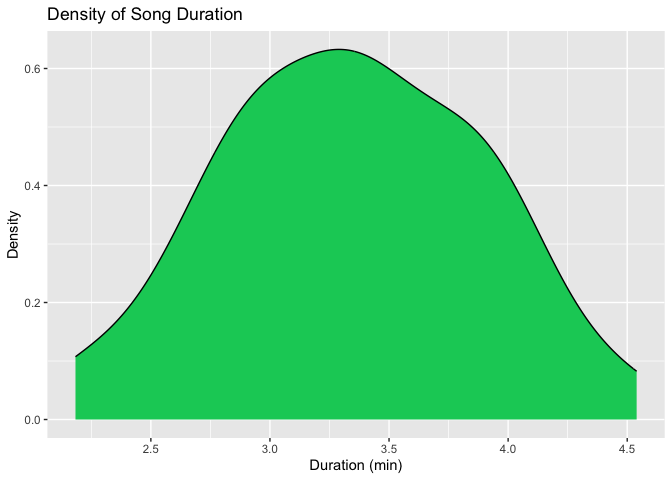
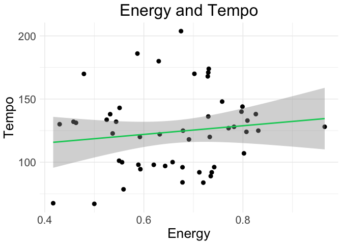
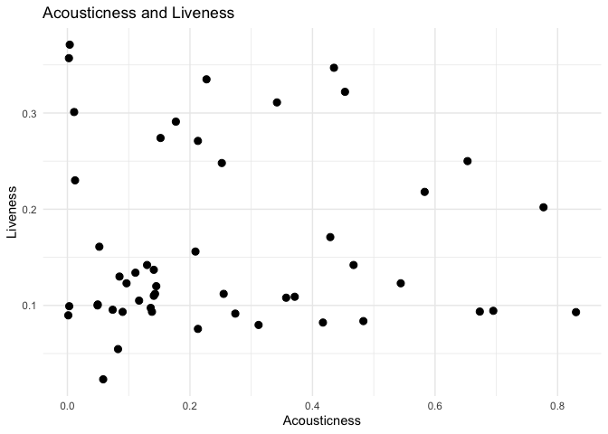

```r
library(tidyverse)
library(janitor)
library(naniar)
library(tidyr)
```


```r
spotify2023 <- read_csv("top_50_2023.csv") %>% clean_names()
```

```
## Rows: 50 Columns: 19
## ── Column specification ────────────────────────────────────────────────────────
## Delimiter: ","
## chr   (3): artist_name, track_name, genres
## dbl  (14): danceability, valence, energy, loudness, acousticness, instrument...
## lgl   (1): is_explicit
## date  (1): album_release_date
## 
## ℹ Use `spec()` to retrieve the full column specification for this data.
## ℹ Specify the column types or set `show_col_types = FALSE` to quiet this message.
```


```r
split_spotify2023 <- spotify2023 %>% 
  separate(genres, into = c("genre1", "genre2", "genre3", "genre4", "genre5", "genre6"), sep=",") %>% 
  pivot_longer(cols = starts_with("genre"),
               names_to = "type",
               values_to = "class") %>% 
  filter(class != "NA") %>% 
  select(-type)
```

```
## Warning: Expected 6 pieces. Missing pieces filled with `NA` in 48 rows [1, 2, 3, 4, 5,
## 6, 7, 8, 9, 10, 11, 12, 13, 14, 15, 16, 17, 19, 20, 21, ...].
```

## Re-use select to pull out the punctuation

```r
split_spotify2023 <- split_spotify2023 %>% 
  separate(class, into = c("punctuation", "class2"), sep = "'") %>% 
  select(-punctuation)
```

```
## Warning: Expected 2 pieces. Additional pieces discarded in 126 rows [1, 2, 3, 4, 5, 6,
## 7, 8, 9, 10, 11, 12, 13, 14, 15, 16, 17, 18, 19, 20, ...].
```

## pivot_wider 

```r
split_spotify2023 <- split_spotify2023 %>%
    pivot_wider(
        names_from = class2,
        values_from = class2,
        values_fn = length) %>% 
  mutate(across(everything(), ~replace(.x, is.na(.x), 0)))
```

## Seperate the album release data into year, month, and day

```r
spotify <- split_spotify2023 %>% 
  separate(album_release_date, into = c("year", "month", "day"), sep = "-") %>% 
  clean_names()
```


```r
names(spotify)
```

```
##  [1] "artist_name"               "track_name"               
##  [3] "is_explicit"               "year"                     
##  [5] "month"                     "day"                      
##  [7] "danceability"              "valence"                  
##  [9] "energy"                    "loudness"                 
## [11] "acousticness"              "instrumentalness"         
## [13] "liveness"                  "speechiness"              
## [15] "key"                       "tempo"                    
## [17] "mode"                      "duration_ms"              
## [19] "time_signature"            "popularity"               
## [21] "pop"                       "r_b"                      
## [23] "rap"                       "k_pop"                    
## [25] "corrido"                   "corridos_tumbados"        
## [27] "sad_sierreno"              "sierreno"                 
## [29] "afrobeats"                 "nigerian_pop"             
## [31] "argentine_hip_hop"         "pop_venezolano"           
## [33] "trap_argentino"            "trap_latino"              
## [35] "urbano_latino"             "garage_rock"              
## [37] "modern_rock"               "permanent_wave"           
## [39] "rock"                      "sheffield_indie"          
## [41] "reggaeton"                 "reggaeton_colombiano"     
## [43] "urbano_mexicano"           "big_room"                 
## [45] "dance_pop"                 "edm"                      
## [47] "pop_dance"                 "canadian_contemporary_r_b"
## [49] "canadian_pop"              "musica_chihuahuense"      
## [51] "uk_pop"                    "colombian_pop"            
## [53] "latin_pop"                 "bedroom_pop"              
## [55] "gen_z_singer_songwriter"   "singer_songwriter_pop"    
## [57] "chill_pop"                 "latin_hip_hop"            
## [59] "k_pop_girl_group"          "piano_rock"               
## [61] "contemporary_country"      "modern_indie_pop"         
## [63] "pov_indie"                 "puerto_rican_pop"         
## [65] "pop_reggaeton"             "modern_alternative_rock"  
## [67] "detroit_hip_hop"           "hip_hop"                  
## [69] "uk_contemporary_r_b"       "musica_mexicana"
```


## Count the total number of song in each column from pop to musica_chihuahuense and fill with springgreen3 and outline in black. 

```r
spotify %>% 
  select(pop:musica_chihuahuense) %>% 
  gather(key = "genre", value = "count") %>% 
  ggplot(aes(x = genre, y = count)) +
  geom_bar(stat = "identity", fill = "springgreen3", color="black") +
  labs(title = "Number of Songs in Each Genre",
       x = "Genre",
       y = "Number of Songs")+
  coord_flip()
```

<!-- -->


## Pull all the pop songs and make a scatterplot graph with the dancibility and energy. Make sure to add color

```r
spotify %>% 
  filter(pop > 0) %>% 
  ggplot(aes(x = danceability, y = energy, color = danceability)) +
  geom_point() +
  labs(title = "Pop Songs 2023",
       x = "Danceability",
       y = "Energy")
```

<!-- -->

## Make a bar plot for all the songs released

```r
spotify %>% 
  ggplot(aes(x = year)) +
  geom_bar() +
  labs(title = "Songs Released in 2023",
       x = "Year",
       y = "Number of Songs")
```

<!-- -->

## How many songs are in pop through rock? Make a graph

```r
spotify %>% 
  select(pop:rock) %>% 
  gather(key = "genre", value = "count") %>% 
  ggplot(aes(x = genre, y = count)) +
  geom_bar(stat = "identity") +
  labs(title = "Number of Songs in Each Genre",
       x = "Genre",
       y = "Number of Songs")+
  coord_flip()
```

<!-- -->

## Pull all the columns that contain the word `pop` but remove popularity. Make a graph of the counts in each column and make sure to include the category pop. fill the bars with the color springgreen3.

```r
spotify %>% 
  select(contains("pop")) %>% 
  select(-popularity) %>% 
  gather(key = "pop", value = "count") %>% 
  ggplot(aes(x = pop, y = count)) +
  geom_bar(stat = "identity", fill = "springgreen3") +
  labs(title = "All Pop Songs",
       x = NULL,
       y = "Number of Songs")+
  coord_flip()
```

<!-- -->

## make a shiny app for all the graphs used so far. Make sure to include the headers and sidebar

```r
library(shiny)
library(shinydashboard)
```

```
## 
## Attaching package: 'shinydashboard'
```

```
## The following object is masked from 'package:graphics':
## 
##     box
```

```r
ui <- dashboardPage(
  dashboardHeader(title = "Spotify 2023"),
  dashboardSidebar(
    sidebarMenu(
      menuItem("Scatterplot", tabName = "scatter"),
      menuItem("Barplot", tabName = "bar"),
      menuItem("Genre Barplot", tabName = "genre"),
      menuItem("Pop Songs", tabName = "pop")
    )
  ),
  dashboardBody(
    tabItems(
      tabItem(tabName = "scatter",
              fluidRow(
                box(plotOutput("scatterplot", height = 250))
              )
      ),
      tabItem(tabName = "bar",
              fluidRow(
                box(plotOutput("barplot", height = 250))
              )
      ),
      tabItem(tabName = "genre",
              fluidRow(
                box(plotOutput("genrebarplot", height = 250))
              )
      ),
      tabItem(tabName = "pop",
              fluidRow(
                box(plotOutput("popbarplot", height = 250))
              )
      )
    )
  )
)

server <- function(input, output) {
  output$scatterplot <- renderPlot({
    spotify %>% 
      filter(pop > 0) %>% 
      ggplot(aes(x = danceability, y = energy, color = danceability)) +
      geom_point() +
      labs(title = "Pop Songs 2023",
           x = "Danceability",
           y = "Energy")
  })
  
  output$barplot <- renderPlot({
    spotify %>% 
      ggplot(aes(x = year)) +
      geom_bar() +
      labs(title = "Songs Released in 2023",
           x = "Year",
           y = "Number of Songs")
  })
  
  output$genrebarplot <- renderPlot({
    spotify %>% 
      select(pop:rock) %>% 
      gather(key = "genre", value = "count") %>% 
      ggplot(aes(x = genre, y = count)) +
      geom_bar(stat = "identity") +
      labs(title = "Number of Songs in Each Genre",
           x = "Genre",
           y = "Number of Songs")+
      coord_flip()
  })
  
  output$popbarplot <- renderPlot({
    spotify %>% 
      select(contains("pop")) %>% 
      select(-popularity) %>% 
      gather(key = "pop", value = "count") %>% 
      ggplot(aes(x = pop, y = count)) +
      geom_bar(stat = "identity") +
      labs(title = "All Pop Songs",
           x = NULL,
           y = "Number of Songs")+
      coord_flip()
  })
}

shinyApp(ui, server)
```

```{=html}
<div style="width: 100% ; height: 400px ; text-align: center; box-sizing: border-box; -moz-box-sizing: border-box; -webkit-box-sizing: border-box;" class="muted well">Shiny applications not supported in static R Markdown documents</div>
```


## what is the most commonly occuring artist

```r
spotify %>% 
  count(artist_name) %>% 
  arrange(desc(n))
```

```
## # A tibble: 41 × 2
##    artist_name        n
##    <chr>          <int>
##  1 The Weeknd         4
##  2 Taylor Swift       3
##  3 Bad Bunny          2
##  4 Bizarrap           2
##  5 SZA                2
##  6 d4vd               2
##  7 Arctic Monkeys     1
##  8 David Guetta       1
##  9 David Kushner      1
## 10 Doja Cat           1
## # ℹ 31 more rows
```

## make a denisty graph on the duration of all songs and convert milliseconds to minutes. color the graph in springgreen3. chnage the bins size to 10

```r
spotify %>% 
  mutate(duration_ms = duration_ms/60000) %>%
  ggplot(aes(x = duration_ms)) +
  geom_density(fill = "springgreen3") +
  labs(title = "Density of Song Duration",
       x = "Duration (min)",
       y = "Density")
```

<!-- -->


## make a grpah on the dancability and energy. fill the dots in springgreen3 and increase the size of the dots to 2

```r
spotify %>% 
  ggplot(aes(x = danceability, y = energy)) +
  geom_point(size = 2.5) +
  labs(title = "Danceability and Energy",
       x = "Danceability",
       y = "Energy")+
  theme_minimal()
```

<!-- -->

## what are all the k_pop and k_pop_girl_group songs

```r
spotify %>%
  filter(k_pop > 0 | k_pop_girl_group >0) %>% 
  select(artist_name, track_name) 
```

```
## # A tibble: 4 × 2
##   artist_name track_name                         
##   <chr>       <chr>                              
## 1 Jung Kook   Seven (feat. Latto) (Explicit Ver.)
## 2 FIFTY FIFTY Cupid - Twin Ver.                  
## 3 Jimin       Like Crazy                         
## 4 NewJeans    OMG
```

## what is the danciability and speechiness of k_pop and k_pop_girl_group songs

```r
spotify %>%
  filter(k_pop > 0 | k_pop_girl_group >0) %>%
  ggplot(aes(x = danceability, y = energy, color = track_name)) +
  geom_point() 
```

<!-- -->

## Make a graoh of liveness and speechiness of all the songs

```r
spotify %>%
  ggplot(aes(x = liveness, y = acousticness)) +
  geom_point() 
```

<!-- -->

## Make a graph of the key versus valence. Split valence equally into 5 groups

```r
spotify %>%
  ggplot(aes(x = key, y = valence, color = valence)) +
  geom_point() +
  facet_wrap(~cut(valence, 5)) 
```

<!-- -->

## mutate is_explicit into 2 categories. make side by side boxplots of these categories and the loudness

```r
spotify %>%
  mutate(is_explicit = ifelse(is_explicit == 1, "Explicit", "Not Explicit")) %>%
  ggplot(aes(x = is_explicit, y = loudness, fill = is_explicit)) +
  geom_boxplot(fill="springgreen3") +
  labs(title = "Loudness of Explicit and Non-Explicit Songs",
       x = NULL,
       y = "Loudness")+
  theme_minimal()
```

<!-- -->


## Make a graph of the dancability and tempo

```r
spotify %>%
  ggplot(aes(x = danceability, y = tempo)) +
  geom_point(size=2.5) +
  labs(title = "Danceability and Tempo",
       x = "Danceability",
       y = "Tempo")+
  theme_minimal()
```

<!-- -->


## Make a graph of the energy and tempo

```r
spotify %>%
  ggplot(aes(x = energy, y = tempo)) +
  geom_point(size=2.5) +
  labs(title = "Energy and Tempo",
       x = "Energy",
       y = "Tempo")+
  theme_minimal()
```

<!-- -->

## Make a graph of the dancability and valance. Add a regression line

```r
spotify %>%
  ggplot(aes(x = danceability, y = valence)) +
  geom_point(size=2.5) +
  geom_smooth(method = "lm", color="springgreen3") +
  labs(title = "Danceability and Valence",
       x = "Danceability",
       y = "Valence")+
  theme_minimal()
```

```
## `geom_smooth()` using formula = 'y ~ x'
```

<!-- -->

Make a graph on energy and temp and increase the text size to 20 and make the text in the middle

```r
spotify %>%
  ggplot(aes(x = energy, y = tempo)) +
  geom_point(size=2.5) +
  geom_smooth(method = "lm", color="springgreen3") +
  labs(title = "Energy and Tempo",
       x = "Energy",
       y = "Tempo")+
  theme_minimal()+
  theme(text = element_text(size = 20))+
  theme(plot.title = element_text(hjust = 0.5))
```

```
## `geom_smooth()` using formula = 'y ~ x'
```

<!-- -->

## Make a graph of the acousticts and liveiness

```r
spotify %>%
  ggplot(aes(x = acousticness, y = liveness)) +
  geom_point(size=2.5) +
  labs(title = "Acousticness and Liveness",
       x = "Acousticness",
       y = "Liveness")+
  theme_minimal()
```

<!-- -->

## Group by artist name and count the number of songs released by the top 5 artist. Fill the bars with springgreen3

```r
spotify %>%
  count(artist_name) %>%
  top_n(5) %>%
  ggplot(aes(x = reorder(artist_name, -n), y = n)) +
  geom_bar(stat = "identity", fill = "springgreen3", color="black") +
  labs(title = "Top 5 Artists with the Most Songs",
       x = NULL,
       y = "Number of Songs")+
  theme_minimal()
```

```
## Selecting by n
```

<!-- -->

